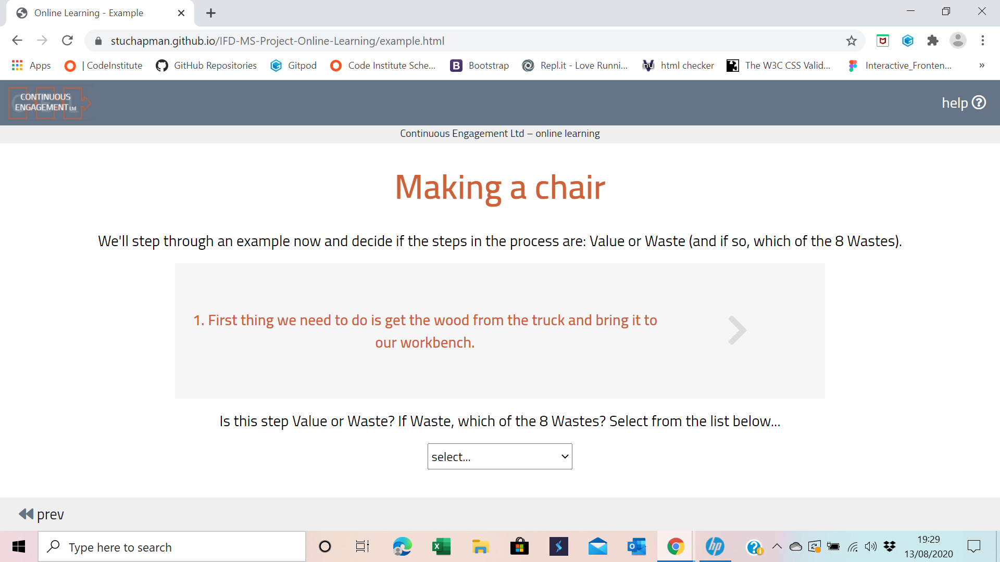
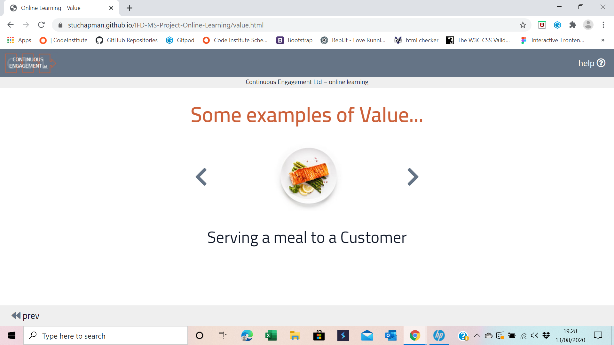
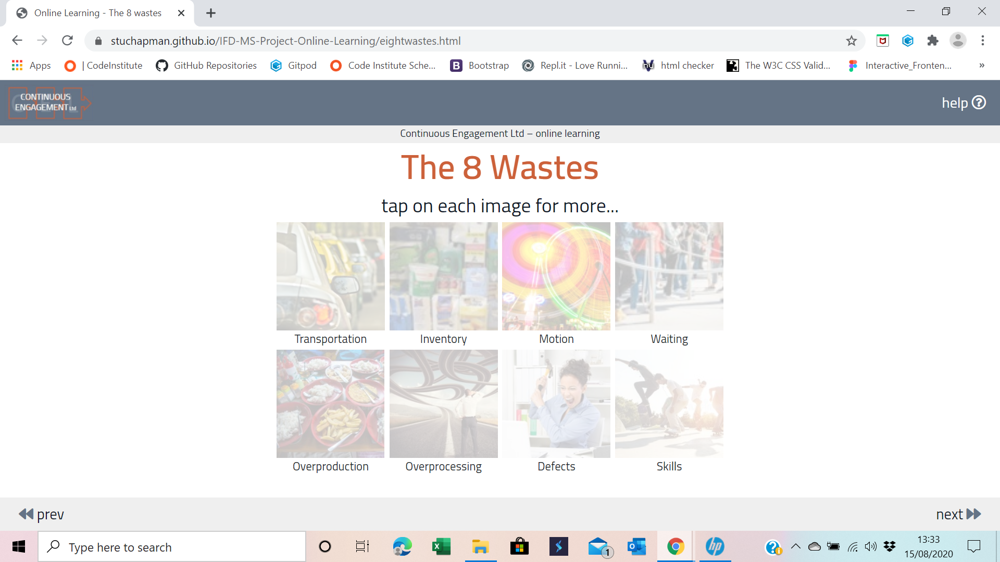
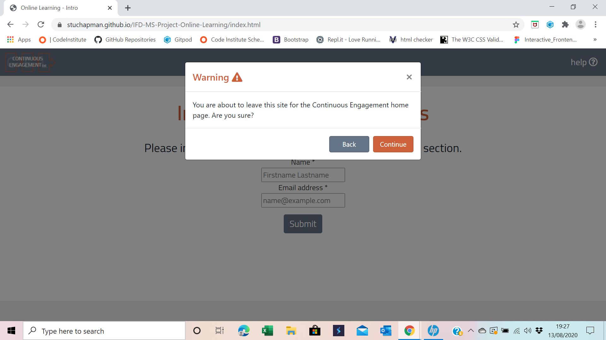

# Testing
My approach to testing was to test each of the features for functionality (operation) and rendering (visuals) against a variety of media devices, in both portrait and landscape orientation, as well as the 4 main browsers.

I created a matrix to complete methodically to ensure all functions operated and rendered correctly.

For testing mid-build, I often logged variables to the console. This helped me see that variables were populating as designed (or not!) and that code had executed as planned.

I commented these in the scripts.js file with "// log to Console to test Functionality //" 

## Validation

### html Validation using [w3 validator](https://validator.w3.org/)

I received the following warning multiple times for every html file...

*Warning: The type attribute is unnecessary for JavaScript resources.*

All of the resources I could find (Stack Overflow etc.) advised that this should be used as a warning, rather than a bug ... [example](https://www.webmasterworld.com/javascript/4879097.htm).

I decided to remove the type and fully test all pages and functionality post this.

Another error; *Error: The element a must not appear as a descendant of the button element.* needed a solution, so I replaced the anchor element with the call of a function.

```javascript
<button type="button" class="btn btn-orange">
                            <a href="https://stuchapman.github.io/UCD-MS-Project-Continuous-Engagement/index.html">
                                Continue
                            </a>
                        </button>
```

was changed to.

```javascript
<button type="button" class="btn btn-orange" onclick="return goCELHome();">Continue
                        </button>
```

with the function,

```javascript
// Function: navigate to Continuous Engagament Ltd homepage //
function goCELHome() {
window.location.replace('https://stuchapman.github.io/UCD-MS-Project-Continuous-Engagement/index.html');
}
```

added in [scripts-global-variables.js](https://github.com/StuChapman/IFD-MS-Project-Online-Learning/blob/master/assets/js/scripts-global-variables.js).

### javascript Validation using [jshint](https://jshint.com/)

I received the following warning multiple times for every js file...

*'let' is available in ES6 (use 'esversion: 6') or Mozilla JS extensions (use moz).*

After some research; I found the following [teamtreehouse](https://teamtreehouse.com/community/why-does-jshint-give-me-these-warnings-about-es6) discussion, which presented a solution of placing the following comment.
```javascript
// jshint esversion: 6
```
At the start of each js file.

### css Validation using [jigsaw](https://jigsaw.w3.org/css-validator/)

css validation presented no errors.

## Challenges, Bugs and Errors

Whilst in build, the following: challenges, bugs and errors required solutions...

    Challenge:  User accidentally tapping Brand Image and navigating away from the application.
    Solution:   A Bootstrap Modal asking the user *"You are about to leave this site for the Continuous Engagement home page. Are you sure?"*.

    Challenge:  User navigates back and forth through test with the browser back and forward navigation, thus allowing repeated attempts at the test.
    Solution:   Create the 10 'answerFlagXXX' variables to check if this question has already been answered, an alert the user, and navigated to the next question.

    Challenge:  An uploaded .mp4 video file would not play in deployed version due to it's filesize.
    Solution:   Link to the video through YouTube API.

    Challenge:  Rendering on mobile device, landscape view (especially where a grid was used).
    Solution:   Utilise: @media screen and (orientation: portrait) and (orientation: landscape).

    Challenge:  Need to record the scores to the test questions.
    Solution:   Write variables to local storage.

    Bug:        Original method of $("#arrow_____").animate to reveal the definition of Value/Waste on definition.html caused the text within the div to constantly re-format as the div expanded to size.
    Solution:   Create masks $("#arrowmask_____").animate to reveal the definition, by shrinking the mask, rather than growing the div.

    Bug:        Images on revealed div on eightwastes.html taking time to cache, leaving previous image visible. This could be confusing to the user.
    Solution:   Add a 200ms delay after image starts loading, before div is visible.

    Bug:        It is possible to drop multiple cards on question.nine.html into a single box. This is poor user experience.
    Solution:   Once a box has been filled; change ondragover attribute to null - ( $('#' + dragcard3).attr('ondragover', ""); )

    Bug:        Question-ten.html showing as complete when it was incomplete due to the code that grabs the document title ( let thisquestion = document.title.substr(18,10); ) only grabbing 10 characters (so "Question 10" was being truncated to "Question 1").
    Solution:   Change code to ( let thisquestion = document.title.substr(18,11); ).

    Bug:        Method to check questions already answered not operating correctly when pressing the back button on mobile devices.
    Solution:   Chnge method from on 'load' to 'pageshow'.

    Bug:        Help Modal not closing on Submit.
    Solution:   Add ( " data-dismiss="modal" ) to onclick attribute.

    Error:      revealWaste() function declared twice.
    Solution:   Renamed 2nd version as popupWaste().

#### function populateSummary()

I wrote a function to read the 10 answerFlag variables from local storage, convert the value to: P for Pass, F for Fail and _ for 0.
This would then populate test-summary.html.

The challenge I had was: as there were 10 variables, I had to write the code to convert the variable 10 times. This just seemed like a very inelegant solution.

I decided to change the answerFlag variables from text to alphanumeric (i.e. answerFlagOne becomes answerFlag1 etc.). I was then able to create a loop from 1 to 10, running a single block of code 10 times.

This felt like a much cleaner way of achieving the end result. The code is below...

Before.
```javascript
function populateSummary() {
    let result;
    switch (localStorage.getItem('answerFlagOne')) {
        case '-1':
            result = 'Fail';
            break;
        case '0':
            result = 'Null';
            break;
        case '1':
            result = 'Pass';
            ++totalScore;
            break;
        default: 
            break;
    }
    $('#ansone').text(result);
    switch (localStorage.getItem('answerFlagTwo')) {
        case '-1':
            result = 'Fail';
            break;
        case '0':
            result = 'Null';
            break;
        case '1':
            result = 'Pass';
            ++totalScore;
            break;
        default: 
            break;
    }
    $('#anstwo').text(result);

    // and so on for AnswerFlagThree thru Ten ...
```
After.
```javascript
function populateSummary() {
    let totalScore = 0;
    let result;
    let answerVar;
    let answerSpan;
    let i;

    for (i = 0; i < 11; i++) {
        answerVar = 'answerFlag' + i;
        switch (localStorage.getItem(answerVar)) {
            case '-1':
                result = 'Fail';
                break;
            case '0':
                result = 'Null';
                break;
            case '1':
                result = 'Pass';
                ++totalScore;
                break;
            default: 
                break;
        }
        answerSpan = '#answer' + i;
        $(answerSpan).text(result);
    }

    $('#totalScore').text(totalScore + ' out of 10');

}
```
I used this method to replace duplicate code with a loop wherever possible.

## Testing Matrix
Bugs and issues found from testing.

1. eightwastes.html pop-up - typo on the test 'years worth of'. Changed to 'year`s worth of'.
2. question-nine.html Galaxy Fold device on Portrait view - 'moving the work/customer around' text does not fit the card.
3. Whilst testing on Firefox, I noticed that the color of the up and down chevrons on nonvalueadd.html was wrong. I had missed this on all the other devices!
4. There was a rather interesting capability issue when using the browser 'inspect' function. The drag and drop functionality doesn't work in inspect mode. It only works in full view. I tested the functionality on *actual* devices (iPhone, iPad, Samsung, laptop) to ensure this was a bug with my browser, not my software.

## Jasmine Testing

I had a number of attempts with Jasmine testing, but I found none of them to be useful. With the nature of the functions I have used; pulling details from the page the user is currently on, I couldn't find a way to pass those variables to the testscripts.

I tried to 'force' this by hard-wiring the variables into the testscript, but that felt like I was crowbarring it in for the sake of it. To that end I removed the jasmine-testing.html and testscripts.js from my project.

Earlier attempts can be found in my version history.


## Solutions to User Stories

### As the Director of Continuous Engagement, I …

1.	… want to create an online learning experience for my clients.

**Solution:** I have tested the application with a number of live users (including my children!) I have given them no instruction, and asked them to work it through. Some have passed the test, some have failed.

2.	… want the experience to be interactive as well as informative.

Solution: I have deliberately built in features that encourage the user to step through interactive elements before progressing - a good demonstration of this is example.html.

Screenshots:



3.	… want the application to look professional.

**Solution:** I followed the color scheme and layout of the [Continous Engagement Ltd](https://stuchapman.github.io/UCD-MS-Project-Continuous-Engagement/index.html) application.

4.	… want the information contained to be industry standard.

**Solution:** I ensured I used the most up-to-date terminology (e.g. The titles of the 8 wastes).

5.	… want the user to be able to intuitively complete the learning and the test, with as little prompting as possible.

**Solution:** I created the site to have a 'storyline' that had to be followed in a linear fashion. I tested this with live subjects.

Screenshots:



6.	… want the user to be guided through the material via guided navigation devices.

**Solution:** The 'next>>' navigation is only visible once all of the content has been viewed.

Screenshot:


7.	… want the progress for the user to be stored locally so that if there was issue with their device (accidental refresh/loss of power etc) they could pick up where they left off.

**Solution:** 'AnswerFlag's written to local storage and passed through to final result.

Screenshot:


8.	… want the user to be able to ask questions via an email client, understanding that responses are not intended to be instant.

**Solution:** help modal.

Screenshot:


9.	… want there to be pass and fail criteria and the user to be informed via an online “certificate” of their result (preference is a printable .pdf format).

**Solution:** test-certificate.html is formatted to A4, and can be printed to printer or pdf

Screenshot:


10.	… want to use this site as a means to link my consultancy work with my programming work – ultimately adding Agile and Web Development to the showcase.

**Solution:** Branding matched Continuous Engagement Ltd. website. Online Learning application will be accessed via Continuous Engagement Ltd. website. Ability to hyperlink from online Learning application to Continuous Engagement Ltd. website .

Screenshot:


### As the Client/Recruiter, I …

1.	… want to learn some of the basics of Operational Excellence.
2.	… want to know that what I am being taught is industry standard.
3.	… want to be able to roll the learning out to a large number of people.
4.	… want the learning to be fun.
5.	… want the learning to be interactive.
6.	… want the learning to be intuitive.
7.	… want the learning to contain a variety of visuals.
8.	… want the test to be challenging, yet achievable.
9.	… want to be able to move through the learning material at my own pace.
10.	… want to be able to return to a previous section of the material to re-confirm my learning.
11.	… want the material tested to be covered within the learning material – I don’t want to have to leave the app to find the answers.
12.	… want to know if I have passed or failed the test.
13.	… want to be able to resit the test if I have failed.